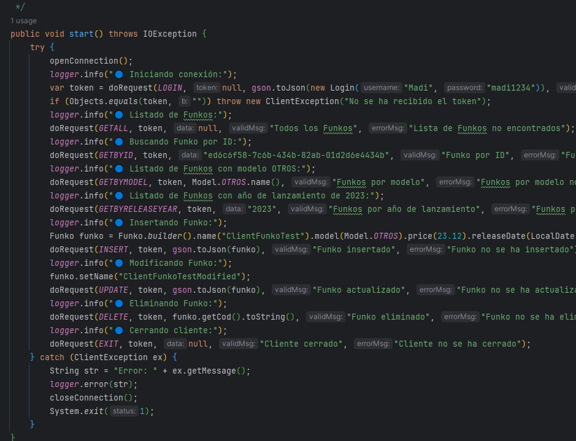
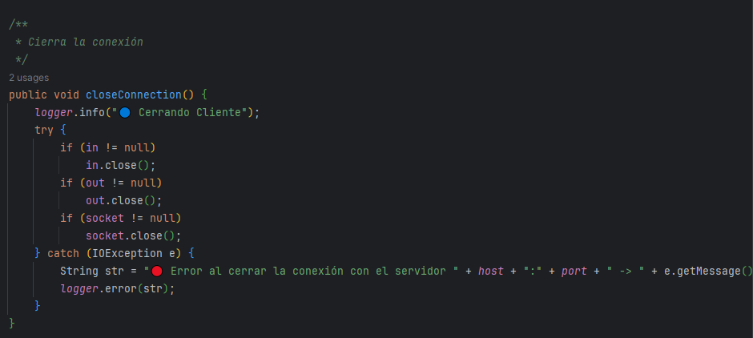
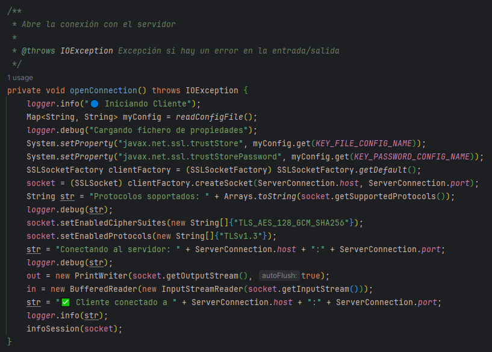
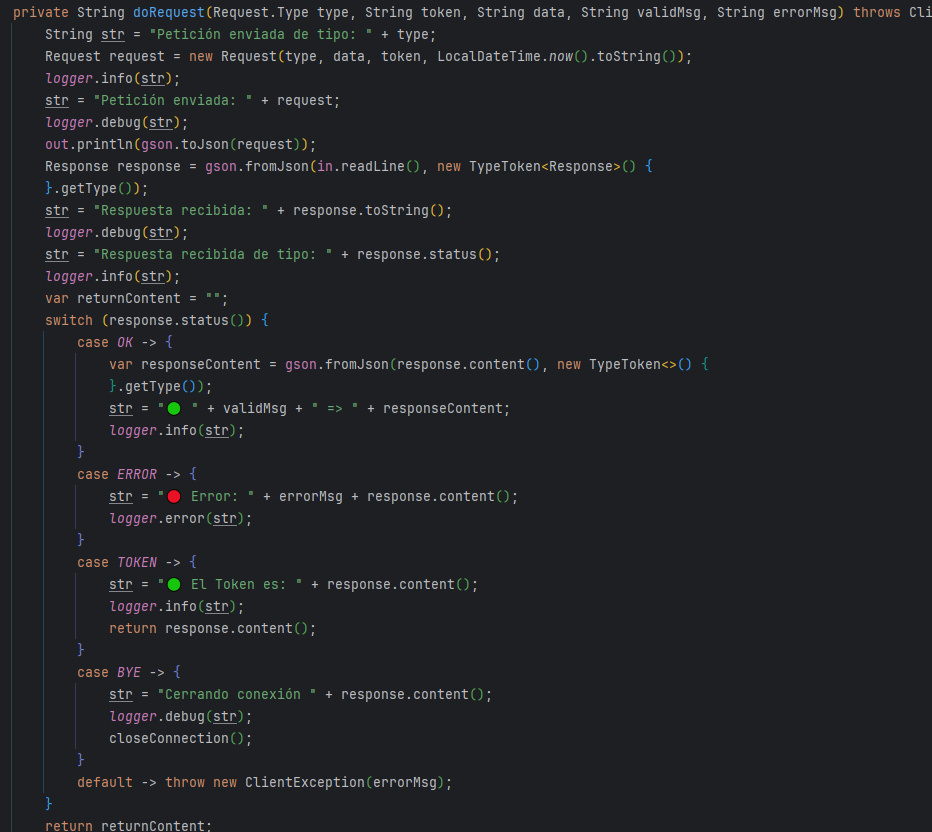
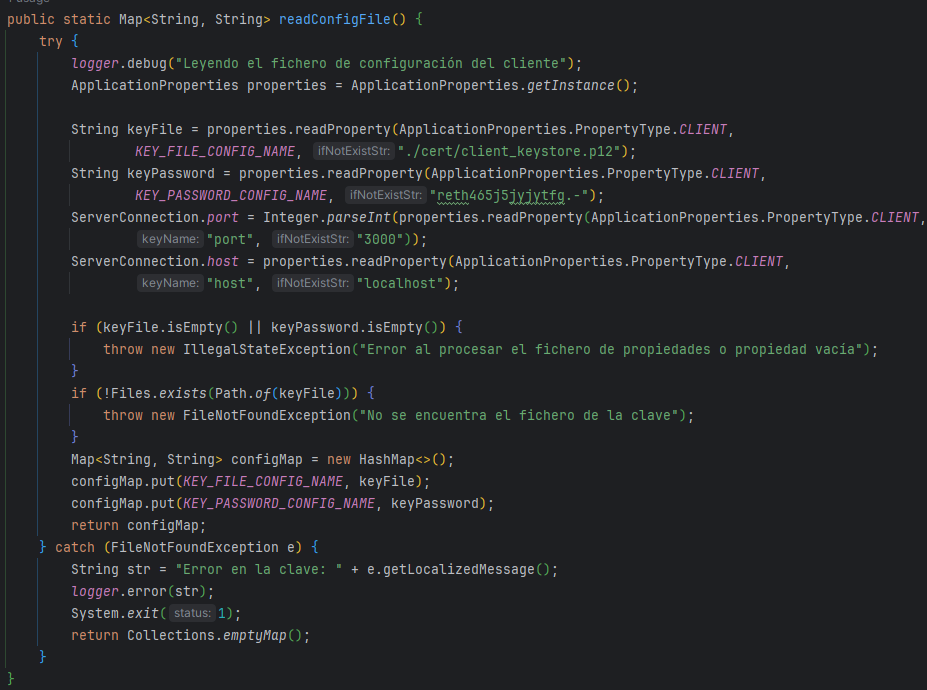
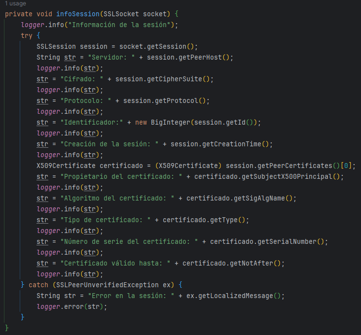
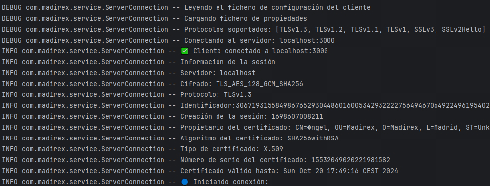

# Funko Sockets Client

  

[Ver servidor](https://github.com/Madirex/funkos-sockets-server)

## 📝 Descripción

Servidor de Sockets API Rest de Funkos programada en Java con Gradle, Spring Boot y base de datos en H2 (modificable desde el archivo properties). Se
realizan tests con JUnit y Mockito.

## 💡 Instrucciones de uso

- **client.properties (java/resources):** Este fichero es el que se deberá modificar si se quiere cambiar el puerto y dirección del servidor a conectar. Además de los datos del Keyfile.

## Cliente

### Implementación

Este método inicializa la conexión y las peticiones al servidor.

  

Este método se encarga de cerrar la conexión.

  

Este método se encarga de abrir la conexión.

  

Este método se encarga de realizar una petición dado un tipo, un token, unos datos, un mensaje cuando la petición se ha realizado correctamente y otro mensaje cuando ocurre algún problema.

  

Este método se encarga de leer el archivo de configuración.

  

Este método se encarga de imprimir en el logger la información de la sesión.

  

## ⚙ Herramientas

- Java 17.
- Gradle.
- H2.
- JUnit.
- Mockito.
- DotEnv.
- Lombok.
- Logback.
- Gson.
- Mybatis.
- Spring Boot.
- R2DBC
- Jbcrypt
- JWT
- Reactor Core

## 🗂️ Organización

- Exceptions: Se encargan de definir las excepciones que se van a utilizar en la aplicación.
- Models: Se encargan de definir los objetos que se van a utilizar en la aplicación.
- Service: Se encarga de realizar las operaciones necesarias de conexión con el servidor.
- Utils: Se encargan de definir las clases útiles que se van a utilizar en la aplicación.

## 🛠️ Utils

El paquete Utils incluye las siguientes utilidades:

- ApplicationProperties: Se encarga de leer el archivo properties y devolver los valores de las propiedades.
- LocalDateAdapter: Se encarga de convertir un LocalDate a un String y viceversa.
- LocalDateTimeAdapter: Se encarga de convertir un LocalDateTime a un String y viceversa.
- Utils: Se encarga de definir métodos útiles para la aplicación.

## Ejecución

  

